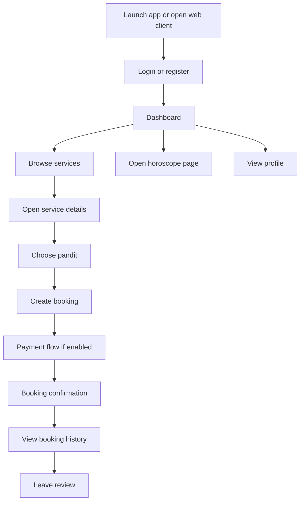

# User Journey

```mermaid
flowchart TD
    S1[Launch app or open web client] --> S2[Login or register]
    S2 --> S3[Dashboard]
    S3 --> S4[Browse services]
    S4 --> S5[Open service details]
    S5 --> S6[Choose pandit]
    S6 --> S7[Create booking]
    S7 --> S8[Payment flow if enabled]
    S8 --> S9[Booking confirmation]
    S9 --> S10[View booking history]
    S10 --> S11[Leave review]
    S3 --> S12[Open horoscope page]
    S3 --> S13[View profile]
```
