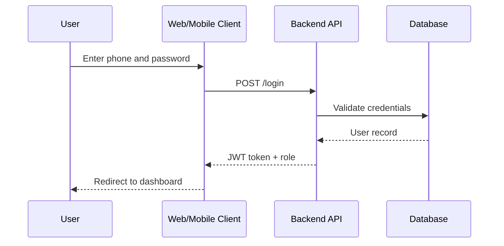

# Sequence Diagrams

## Files

- [Auth sequence](auth-sequence.md)
- [Booking sequence](booking-sequence.md)
- [Pandit approval sequence](pandit-approval-sequence.md)
- [Service management sequence](service-management-sequence.md)
- [Astrology report sequence](astrology-report-sequence.md)
