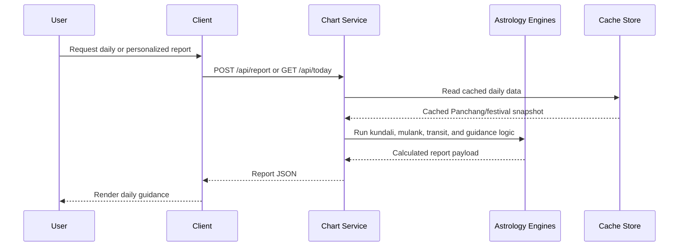

# Astrology Report Sequence

```mermaid
sequenceDiagram
    participant U as User
    participant C as Client
    participant A as Chart Service
    participant E as Astrology Engines
    participant CACHE as Cache Store

    U->>C: Request daily or personalized report
    C->>A: POST /api/report or GET /api/today
    A->>CACHE: Read cached daily data
    CACHE-->>A: Cached Panchang/festival snapshot
    A->>E: Run kundali, mulank, transit, and guidance logic
    E-->>A: Calculated report payload
    A-->>C: Report JSON
    C-->>U: Render daily guidance
```
