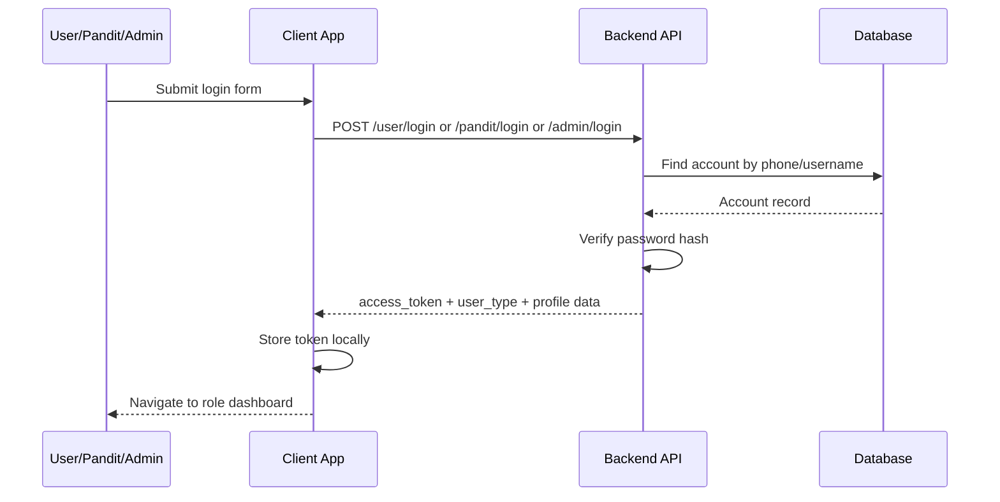

# Authentication Sequence

```mermaid
sequenceDiagram
    participant U as User/Pandit/Admin
    participant C as Client App
    participant B as Backend API
    participant DB as Database

    U->>C: Submit login form
    C->>B: POST /user/login or /pandit/login or /admin/login
    B->>DB: Find account by phone/username
    DB-->>B: Account record
    B->>B: Verify password hash
    B-->>C: access_token + user_type + profile data
    C->>C: Store token locally
    C-->>U: Navigate to role dashboard
```
