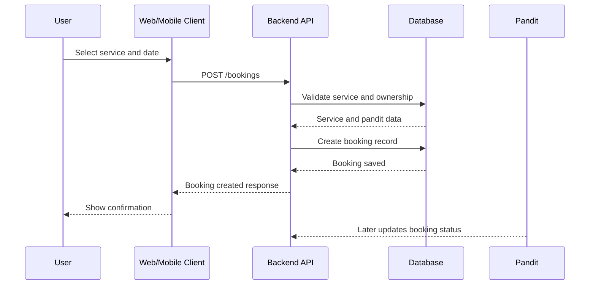

# Booking Sequence

```mermaid
sequenceDiagram
    participant U as User
    participant W as Web/Mobile Client
    participant B as Backend API
    participant DB as Database
    participant P as Pandit

    U->>W: Select service and date
    W->>B: POST /bookings
    B->>DB: Validate service and ownership
    DB-->>B: Service and pandit data
    B->>DB: Create booking record
    DB-->>B: Booking saved
    B-->>W: Booking created response
    W-->>U: Show confirmation
    P-->>B: Later updates booking status
```
