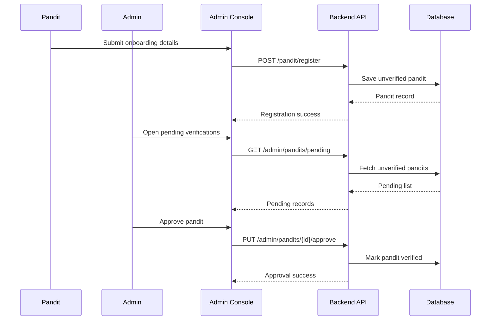

# Pandit Approval Sequence

```mermaid
sequenceDiagram
    participant P as Pandit
    participant A as Admin
    participant C as Admin Console
    participant B as Backend API
    participant DB as Database

    P->>C: Submit onboarding details
    C->>B: POST /pandit/register
    B->>DB: Save unverified pandit
    DB-->>B: Pandit record
    B-->>C: Registration success

    A->>C: Open pending verifications
    C->>B: GET /admin/pandits/pending
    B->>DB: Fetch unverified pandits
    DB-->>B: Pending list
    B-->>C: Pending records
    A->>C: Approve pandit
    C->>B: PUT /admin/pandits/{id}/approve
    B->>DB: Mark pandit verified
    B-->>C: Approval success
```
