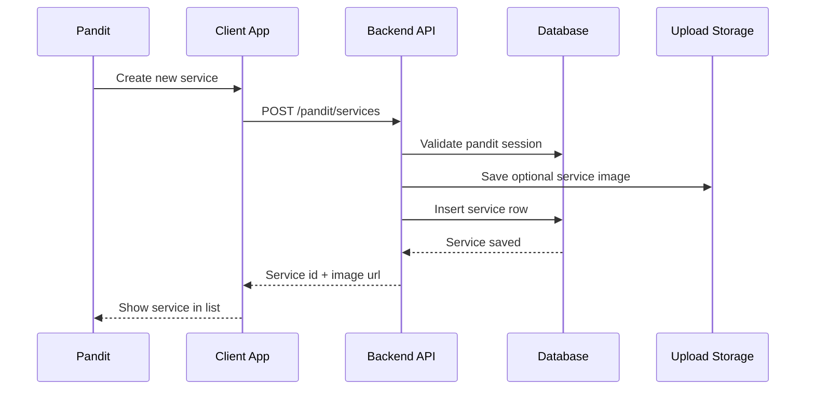

# Service Management Sequence

```mermaid
sequenceDiagram
    participant P as Pandit
    participant C as Client App
    participant B as Backend API
    participant DB as Database
    participant U as Upload Storage

    P->>C: Create new service
    C->>B: POST /pandit/services
    B->>DB: Validate pandit session
    B->>U: Save optional service image
    B->>DB: Insert service row
    DB-->>B: Service saved
    B-->>C: Service id + image url
    C-->>P: Show service in list
```
