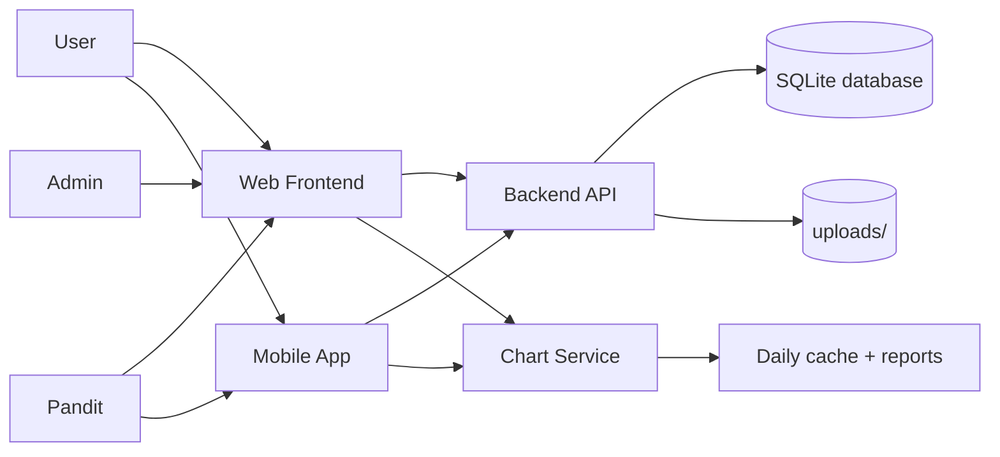

# Workflow Diagrams

## Workflow Files

- [System overview](system-overview.md)
- [Backend workflow](backend-workflow.md)
- [Web frontend workflow](web-frontend-workflow.md)
- [Mobile app workflow](mobile-app-workflow.md)
- [Chart service workflow](chart-service-workflow.md)
- [Deployment and configuration](deployment-and-config.md)
