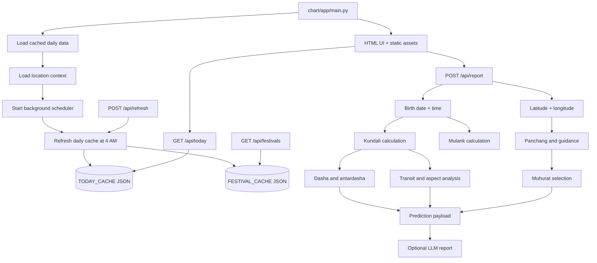

# Chart Service Workflow

```mermaid
flowchart TD
    S[chart/app/main.py] --> C[Load cached daily data]
    C --> L[Load location context]
    L --> SCH[Start background scheduler]

    SCH --> REF[Refresh daily cache at 4 AM]
    REF --> TODAY[(TODAY_CACHE JSON)]
    REF --> FEST[(FESTIVAL_CACHE JSON)]

    R1[GET /api/today] --> TODAY
    R2[GET /api/festivals] --> FEST

    R3[POST /api/report] --> DOB[Birth date + time]
    R3 --> LOC[Latitude + longitude]
    DOB --> K[Kundali calculation]
    DOB --> M[Mulank calculation]
    LOC --> P[Panchang and guidance]
    K --> D[Dasha and antardasha]
    K --> T[Transit and aspect analysis]
    P --> MU[Muhurat selection]
    D --> REP[Prediction payload]
    T --> REP
    MU --> REP
    REP --> LLM[Optional LLM report]

    R4[POST /api/refresh] --> REF
    S --> UI[HTML UI + static assets]
    UI --> R1
    UI --> R3
```
