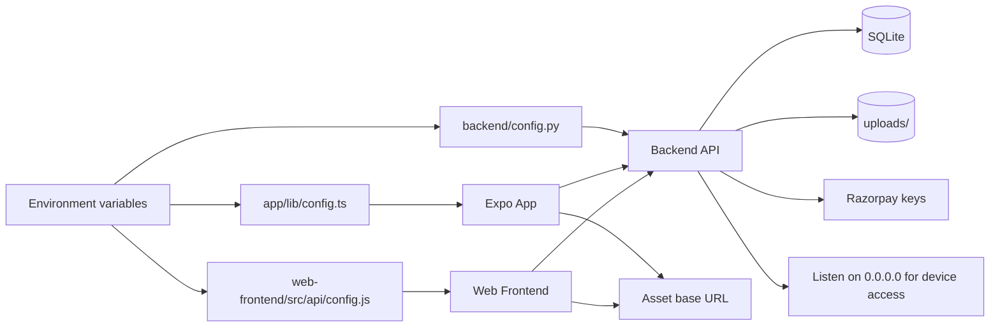

# Deployment And Configuration

```mermaid
flowchart LR
    ENV[Environment variables] --> BECFG[backend/config.py]
    ENV --> ACFG[app/lib/config.ts]
    ENV --> WCFG[web-frontend/src/api/config.js]

    BECFG --> BE[Backend API]
    ACFG --> APP[Expo App]
    WCFG --> WEB[Web Frontend]

    BE --> DB[(SQLite)]
    BE --> UP[(uploads/)]
    APP --> BE
    WEB --> BE
    APP --> ASSET[Asset base URL]
    WEB --> ASSET
    BE --> PAY[Razorpay keys]
    BE --> LAN[Listen on 0.0.0.0 for device access]
```
