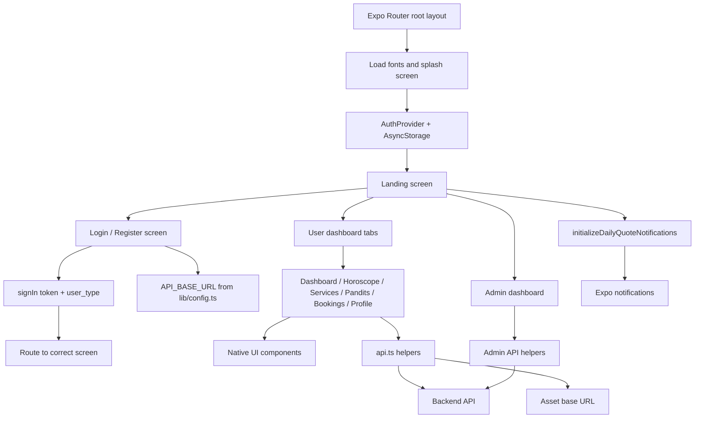

# Mobile App Workflow

```mermaid
flowchart TD
    A[Expo Router root layout] --> F[Load fonts and splash screen]
    F --> AUTH[AuthProvider + AsyncStorage]
    AUTH --> START[Landing screen]

    START --> LOGIN[Login / Register screen]
    START --> USERD[User dashboard tabs]
    START --> ADMIND[Admin dashboard]

    LOGIN --> USERAPI[API_BASE_URL from lib/config.ts]
    LOGIN --> SIGNIN[signIn token + user_type]
    SIGNIN --> ROUTE[Route to correct screen]

    USERD --> TABS[Dashboard / Horoscope / Services / Pandits / Bookings / Profile]
    TABS --> UI[Native UI components]
    TABS --> API[api.ts helpers]
    API --> BE[Backend API]
    API --> ASSET[Asset base URL]

    ADMIND --> ADMINAPI[Admin API helpers]
    ADMINAPI --> BE

    START --> NOTIFY[initializeDailyQuoteNotifications]
    NOTIFY --> PUSH[Expo notifications]
```
