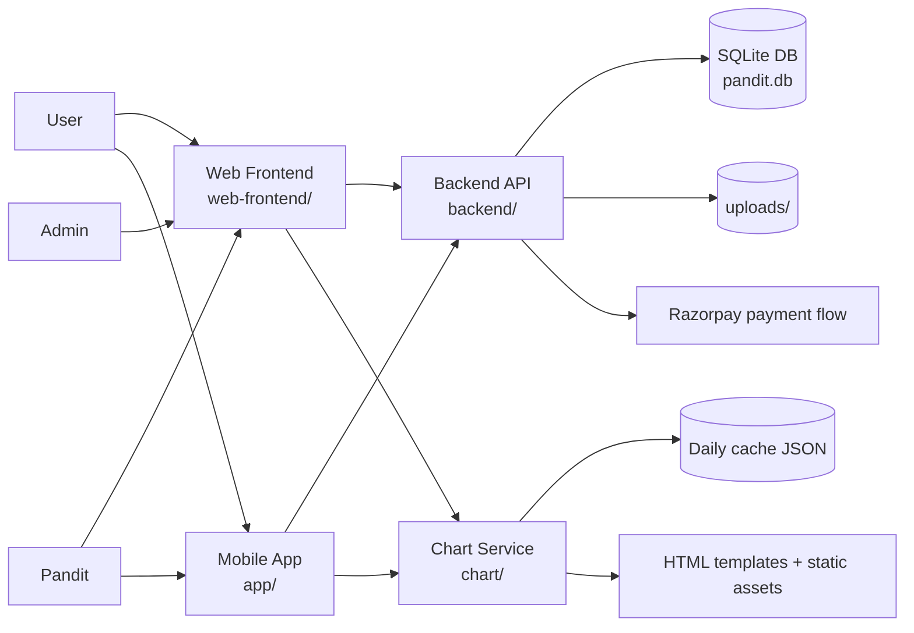

# System Overview

```mermaid
flowchart LR
    U[User] --> W[Web Frontend\nweb-frontend/]
    U --> M[Mobile App\napp/]
    P[Pandit] --> W
    P --> M
    A[Admin] --> W

    W --> B[Backend API\nbackend/]
    M --> B
    W --> C[Chart Service\nchart/]
    M --> C

    B --> DB[(SQLite DB\npandit.db)]
    B --> UP[(uploads/)]
    C --> CACHE[(Daily cache JSON)]
    C --> TEMP[HTML templates + static assets]
    B --> PAY[Razorpay payment flow]
```
