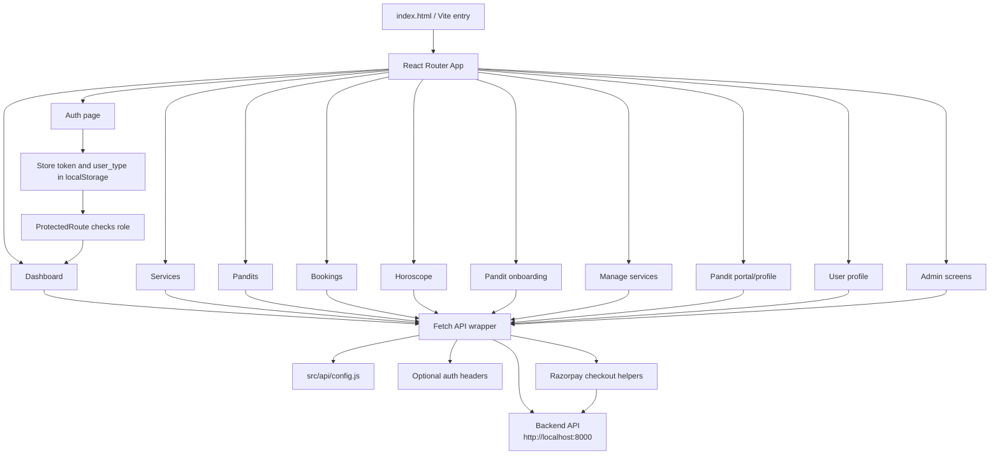

# Web Frontend Workflow

```mermaid
flowchart TD
    I[index.html / Vite entry] --> R[React Router App]
    R --> L[Auth page]
    R --> D[Dashboard]
    R --> S[Services]
    R --> P[Pandits]
    R --> B[Bookings]
    R --> H[Horoscope]
    R --> O[Pandit onboarding]
    R --> MS[Manage services]
    R --> PP[Pandit portal/profile]
    R --> UP[User profile]
    R --> AD[Admin screens]

    L --> TOK[Store token and user_type in localStorage]
    TOK --> PR[ProtectedRoute checks role]
    PR --> D

    D --> API[Fetch API wrapper]
    S --> API
    P --> API
    B --> API
    H --> API
    O --> API
    MS --> API
    PP --> API
    UP --> API
    AD --> API

    API --> CFG[src/api/config.js]
    API --> AUTH[Optional auth headers]
    API --> BE[Backend API\nhttp://localhost:8000]
    API --> PAY[Razorpay checkout helpers]
    PAY --> BE
```
