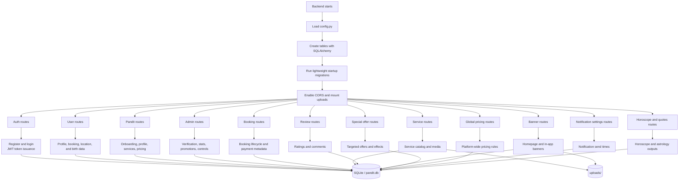

# Backend Workflow

## Notes

- `backend/main.py` is responsible for startup wiring, migrations, CORS, static files, and router registration.
- Models include users, admins, pandits, services, bookings, reviews, banners, special offers, global pricing, and notification schedules.
- Booking records carry payment fields so the platform can track Razorpay order and verification state.
