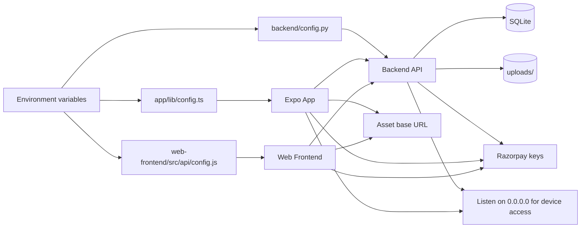

# Deployment And Configuration Flow

## Notes

- The backend, web frontend, and mobile app each have their own base URL configuration.
- For physical mobile devices, the backend must be reachable on the LAN rather than only on localhost.
- Asset URLs should match the backend host because uploaded images are served from the API server.
