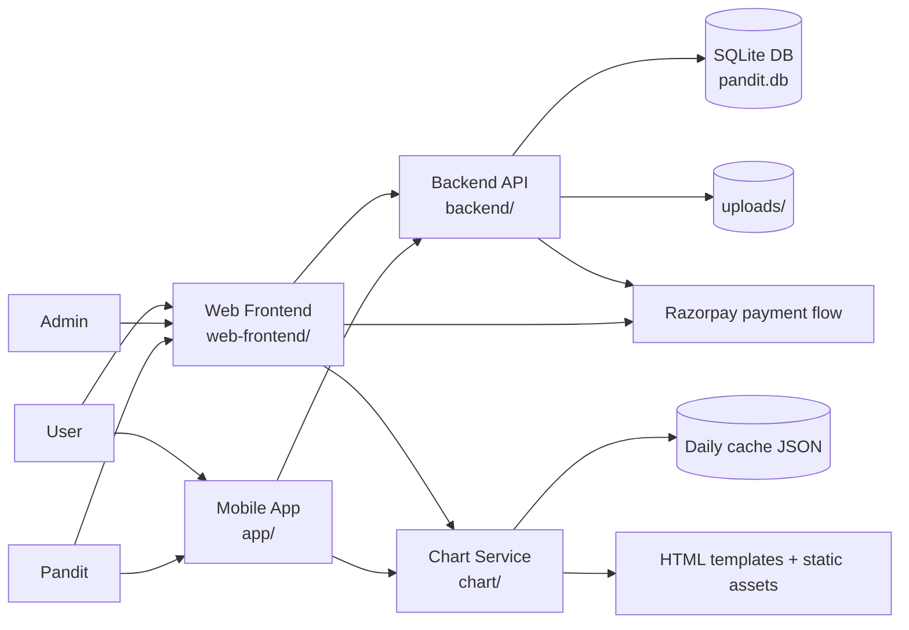

# System Overview

## Notes

- The backend is the central business API for authentication, accounts, bookings, services, and platform controls.
- The web frontend and mobile app both consume the backend API.
- The chart service is a separate astrology-focused FastAPI app that can be run independently.
